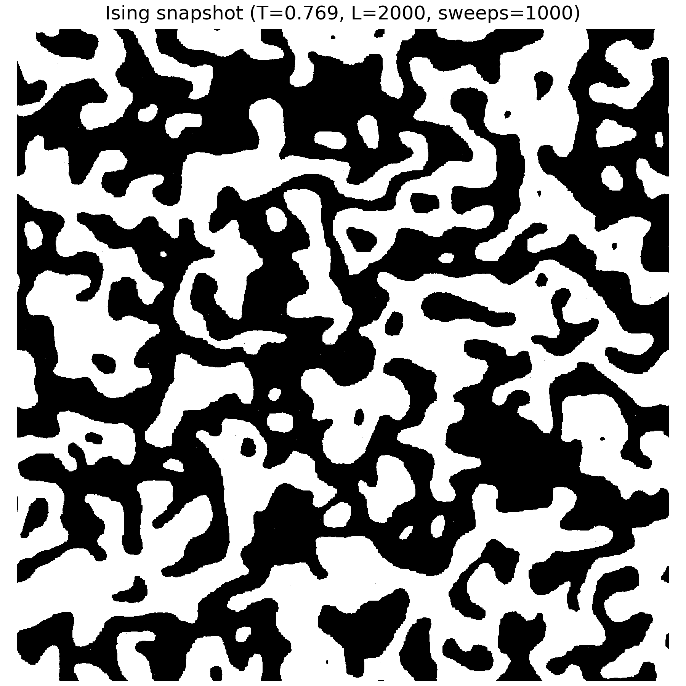
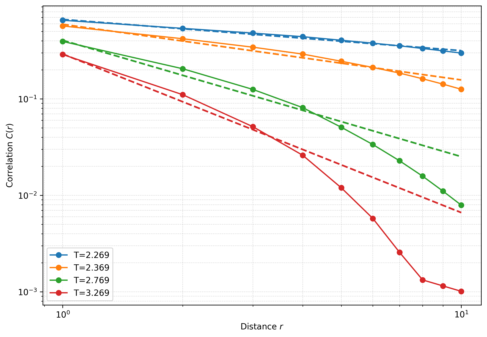

# Ising Model Snapshots and Correlations

### Low Temperature (Ordered Phase)

Large aligned spin domains appear.

---

### Near Critical Temperature \(T_c\)

Fluctuations occur at many length scales.

---

### Above \(T_c\) (Disordered Phase)

Spins appear mostly random with short-range correlations.

---

### Radial Correlation Function (log–log)

Radial spin–spin correlation function \(C(r)\) for several temperatures approaching the critical temperature \(T_c \approx 2.269\).

