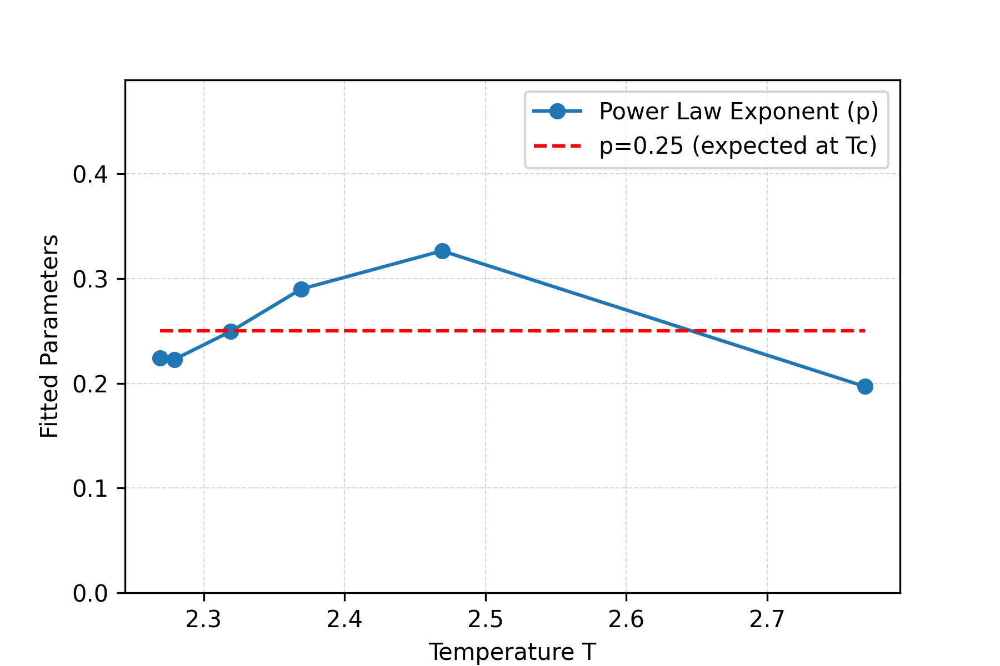

# Ising Model Snapshots and Correlations
 
### To-Do
- [ ] Output a csv with the correlation function results.

### Low Temperature (Ordered Phase)

Large aligned spin domains appear.

---

### Near Critical Temperature \(T_c\)

Fluctuations occur at many length scales.

---

### Above \(T_c\) (Disordered Phase)

Spins appear mostly random with short-range correlations.

---
# Modeling
Using $500 \times 500$ lattice.

### Correlation Fit

Fit using:

$$
C(r) = \frac{Ae^{-r/\xi}}{r^{\eta}}.
$$

### Correlation Length vs Temperature

The correlation length $\xi$ diverges as $T$ approaches $T_c$.

### Power-Law Exponent vs Temperature

 
Should approach $p \approx 0.25$ at $T_c$.

