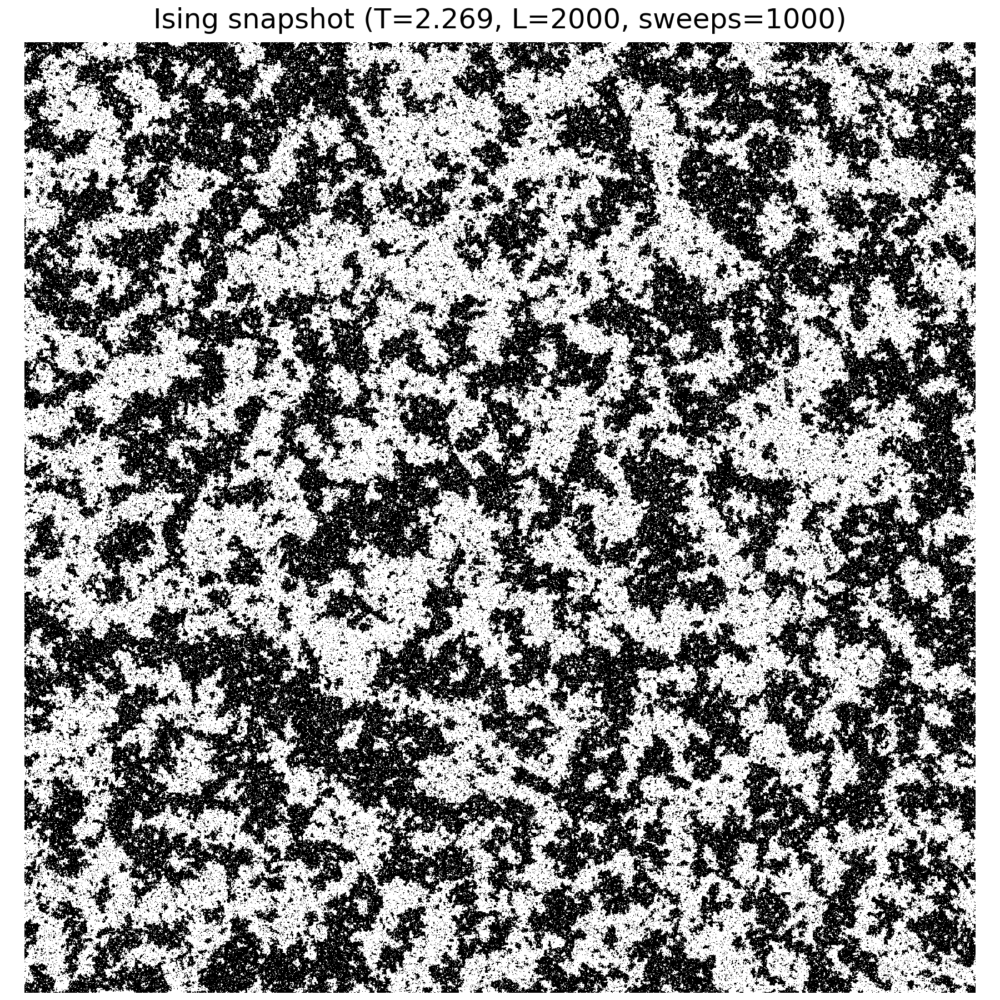
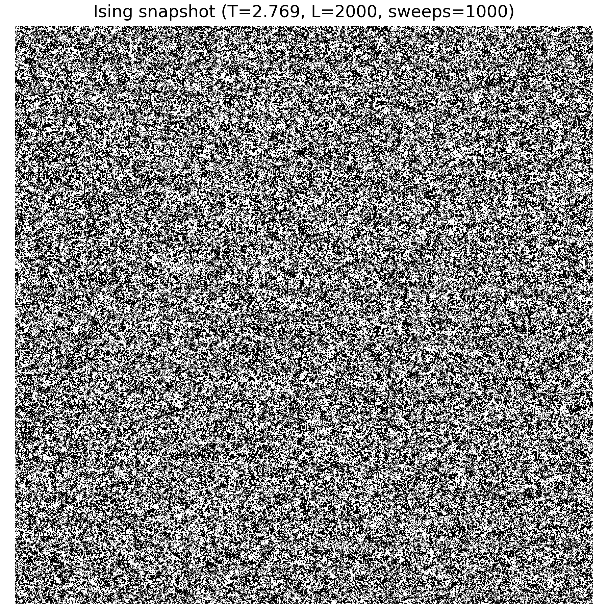
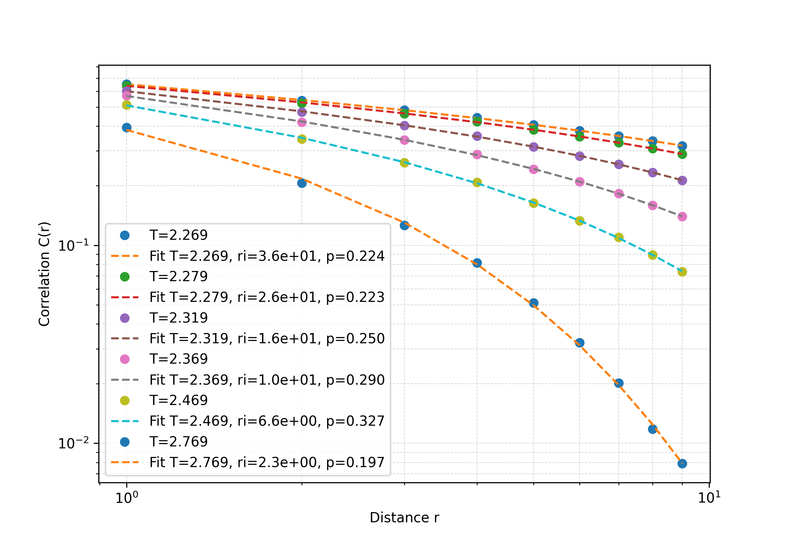
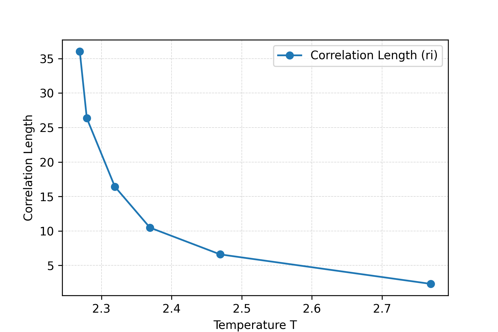
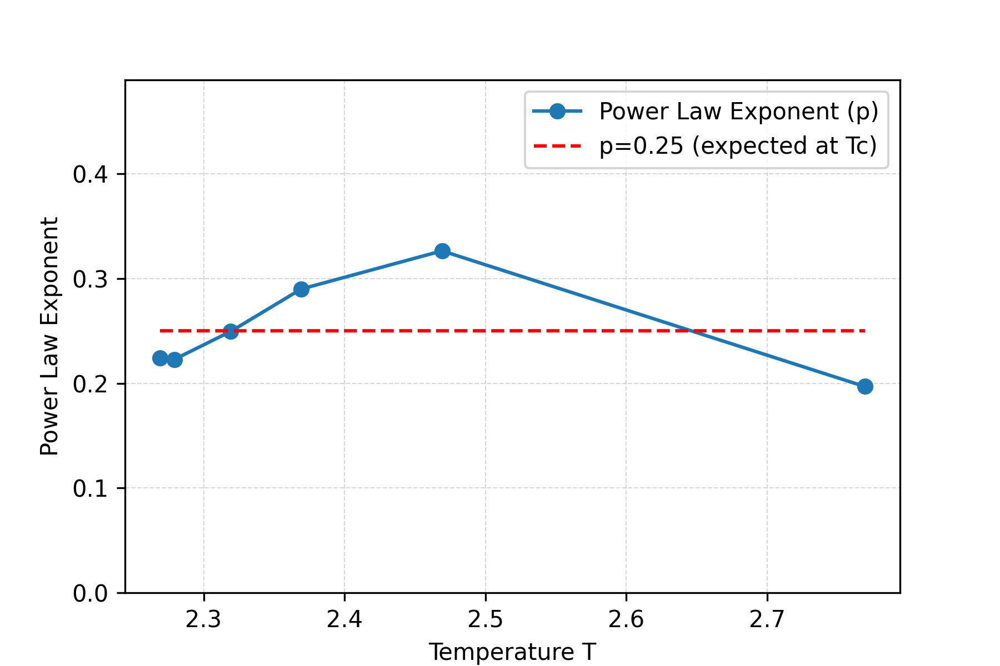

# Ising Model Snapshots and Correlations
 
### Low Temperature (Ordered Phase)

Large aligned spin domains appear.

---

### Near Critical Temperature \(T_c\)

Fluctuations occur at many length scales.

---

### Above \(T_c\) (Disordered Phase)

Spins appear mostly random with short-range correlations.

---
# Modeling
Using $500 \times 500$ lattice.

### Correlation Fit

Fit using:

$$
C(r) = \frac{Ae^{-r/\xi}}{r^{\eta}}.
$$

### Correlation Length vs Temperature

The correlation length $\xi$ diverges as $T$ approaches $T_c$.

### Power-Law Exponent vs Temperature

 
Should approach $p \approx 0.25$ at $T_c$.

---

## Output Files

### Figures

| Directory | Contents |
|---|---|
| `figures/images/` | Spin lattice snapshots (PNG) at various temperatures and lattice sizes |
| `figures/plots/` | Analysis plots (correlation fit, correlation length vs temperature, power-law exponent vs temperature) for 500×500, 1000×1000, and 2000×2000 lattices |

### Data

All CSV files are saved to `data/`:

| File | Contents |
|---|---|
| `data/ising_correlation_<LxL>.csv` | Spatial correlation function $C(r)$ vs distance $r$ at each temperature |
| `data/temp_correlation_<LxL>.csv` | Fitted correlation length $\xi$ and power-law exponent $\eta$ vs temperature |
